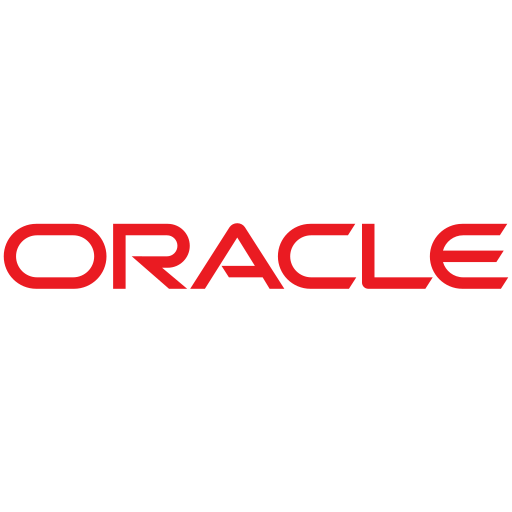
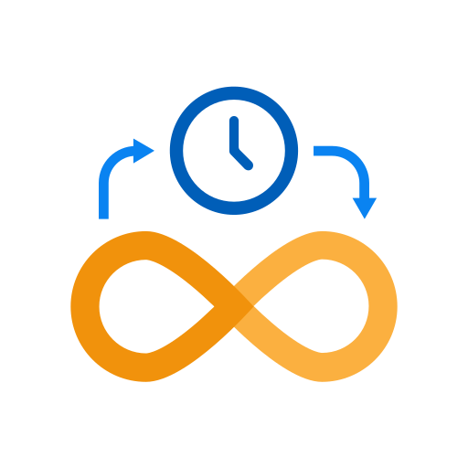

## Olá, sou o Cristian Gustavo! </h2>

- Consultor em **Franco Consultoria**.
- Análise e desenvovimento de sistemas, aplicações, Web Services, rotinas ADVPL e TLPP.

## Habilidades

   

      

         

            ADVPL
            90%
         

         <svg class="rc-progress-line" viewBox="0 0 100 1" preserveAspectRatio="none"><path class="rc-progress-line-trail" d="M 0.5,0.5
               L 99.5,0.5" stroke-linecap="round" stroke="#D9D9D9" stroke-width="1" fill-opacity="0"></path><path class="rc-progress-line-path" d="M 0.5,0.5
               L 99.5,0.5" stroke-linecap="round" stroke="#2596be" stroke-width="1" fill-opacity="0"
               style="stroke-dasharray: 90.0px, 100px; stroke-dashoffset: 0px; transition: stroke-dashoffset 0.3s ease 0s, stroke-dasharray 0.3s ease 0s, stroke 0.3s linear 0s, 0.06s;"></path></svg>
      

      

         

            Protheus: Análise e desenvolvimento
            95%
         

         <svg class="rc-progress-line" viewBox="0 0 100 1" preserveAspectRatio="none"><path class="rc-progress-line-trail" d="M 0.5,0.5
               L 99.5,0.5" stroke-linecap="round" stroke="#D9D9D9" stroke-width="1" fill-opacity="0"></path><path class="rc-progress-line-path" d="M 0.5,0.5
               L 99.5,0.5" stroke-linecap="round" stroke="#2596be" stroke-width="1" fill-opacity="0"
               style="stroke-dasharray: 94.05px, 100px; stroke-dashoffset: 0px; transition: stroke-dashoffset 0.3s ease 0s, stroke-dasharray 0.3s ease 0s, stroke 0.3s linear 0s, 0.06s;"></path></svg>
      

      

         

            Protheus: Web Services Rest
            95%
         

         <svg class="rc-progress-line" viewBox="0 0 100 1" preserveAspectRatio="none"><path class="rc-progress-line-trail" d="M 0.5,0.5
               L 99.5,0.5" stroke-linecap="round" stroke="#D9D9D9" stroke-width="1" fill-opacity="0"></path><path class="rc-progress-line-path" d="M 0.5,0.5
               L 99.5,0.5" stroke-linecap="round" stroke="#2596be" stroke-width="1" fill-opacity="0"
               style="stroke-dasharray: 94.05px, 100px; stroke-dashoffset: 0px; transition: stroke-dashoffset 0.3s ease 0s, stroke-dasharray 0.3s ease 0s, stroke 0.3s linear 0s, 0.06s;"></path></svg>
      

      

         

            Protheus: Instalação e configuração
            65%
         

         <svg class="rc-progress-line" viewBox="0 0 100 1" preserveAspectRatio="none"><path class="rc-progress-line-trail" d="M 0.5,0.5
               L 99.5,0.5" stroke-linecap="round" stroke="#D9D9D9" stroke-width="1" fill-opacity="0"></path><path class="rc-progress-line-path" d="M 0.5,0.5
               L 99.5,0.5" stroke-linecap="round" stroke="#2596be" stroke-width="1" fill-opacity="0"
               style="stroke-dasharray: 65.00px, 100px; stroke-dashoffset: 0px; transition: stroke-dashoffset 0.3s ease 0s, stroke-dasharray 0.3s ease 0s, stroke 0.3s linear 0s, 0.06s;"></path></svg>
      

      <!-- 

         

            Photoshope
            75%
         

         <svg class="rc-progress-line" viewBox="0 0 100 1" preserveAspectRatio="none"><path class="rc-progress-line-trail" d="M 0.5,0.5
               L 99.5,0.5" stroke-linecap="round" stroke="#D9D9D9" stroke-width="1" fill-opacity="0"></path><path class="rc-progress-line-path" d="M 0.5,0.5
               L 99.5,0.5" stroke-linecap="round" stroke="#CA56F2" stroke-width="1" fill-opacity="0"
               style="stroke-dasharray: 74.25px, 100px; stroke-dashoffset: 0px; transition: stroke-dashoffset 0.3s ease 0s, stroke-dasharray 0.3s ease 0s, stroke 0.3s linear 0s, 0.06s;"></path></svg>
      
 -->
   

## Ferramentas 

    
     &nbsp;&nbsp;&nbsp;&nbsp;&nbsp;&nbsp;&nbsp;&nbsp;&nbsp;&nbsp;&nbsp;&nbsp;&nbsp;
    
     &nbsp;&nbsp;&nbsp;&nbsp;&nbsp;&nbsp;&nbsp;&nbsp;&nbsp;&nbsp;&nbsp;&nbsp;&nbsp;
    
     &nbsp;&nbsp;&nbsp;&nbsp;&nbsp;&nbsp;&nbsp;&nbsp;&nbsp;&nbsp;&nbsp;&nbsp;&nbsp;
    
    &nbsp;&nbsp;&nbsp;&nbsp;&nbsp;&nbsp;&nbsp;&nbsp;&nbsp;&nbsp;&nbsp;&nbsp;&nbsp;
     
    &nbsp;&nbsp;&nbsp;&nbsp;&nbsp;&nbsp;&nbsp;&nbsp;&nbsp;&nbsp;&nbsp;&nbsp;&nbsp;
     

## Contato

    
    &nbsp;&nbsp;&nbsp;&nbsp;&nbsp;&nbsp;&nbsp;&nbsp;&nbsp;
    

## Total de Visitas no perfil 

 
 
   
 

